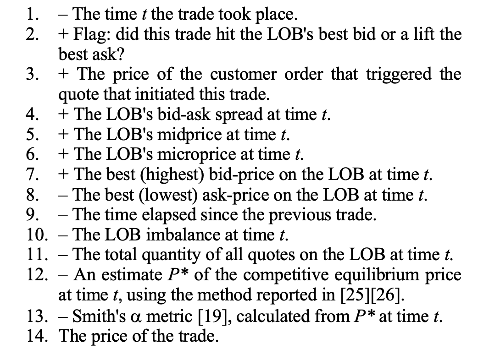

## Initial ideas
>Identify transaction singals(buy or sell)

### Objective
we could consider this problem as different generic tasks in ML.

1. classification task

Predict singal (buy, sell, hold), sepcifically going up, then buying, going down then selling, otherwise, doing nothing   https://arxiv.org/pdf/1808.03668.pdf

2. Regression task
   
TODO

### Hints
1. Live stock prices are deicded by the last time transaction or the micro-price/mid-prices(I am not sure). For high liquid stocks, **mid-prices** and **micro-prices** is quite close.
   
2. Time window is decided by ourselves, we can take 1 minute or 10 seconds to calculate return.

### Dataset building
- Split train/dev/test dataset according to dates

### Input features and labels

1. Classification
   - Features
     -  (https://arxiv.org/pdf/2012.00821.pdf)
     -  sequences of limit bid and ask prices/volumes

   - labels
       create labels according to the previous k prices and the next k prices, details in this paper: https://arxiv.org/pdf/1808.03668.pdf

  
2. Regression
   
TO DO

### Model selection

1. Classification 
2. Bayesian neural networks could be used to provide uncertainty measures which could be useful

Perfer ensemble models and RNNs

### Evaluation

We need to add more details about backlog tests and other evaluation methods.

### Problems

We donnot use transaction data only using LOB data.
For how long is our model valid? Should we 'untrain' our model at any point??

